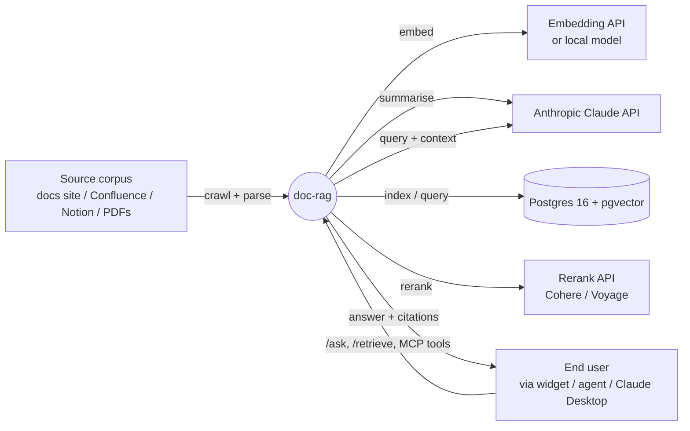
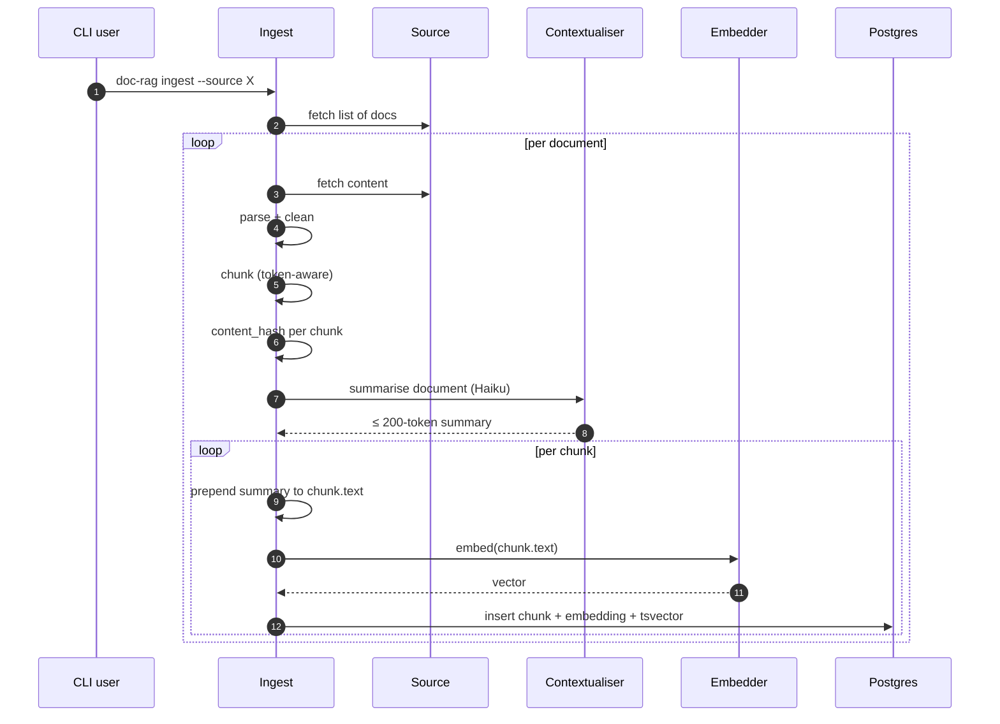
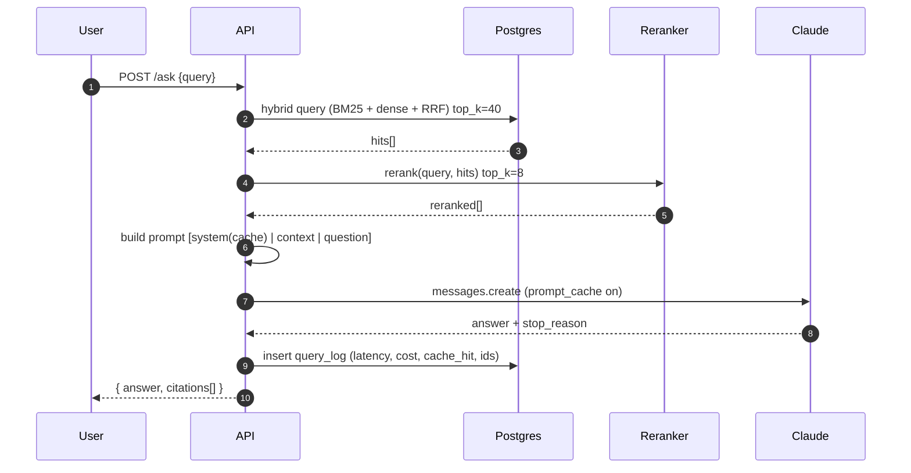
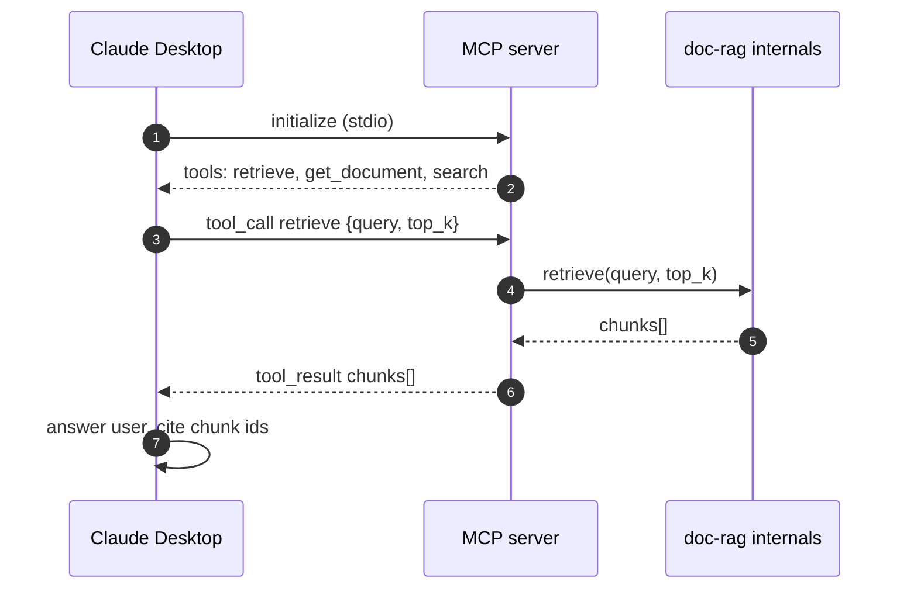
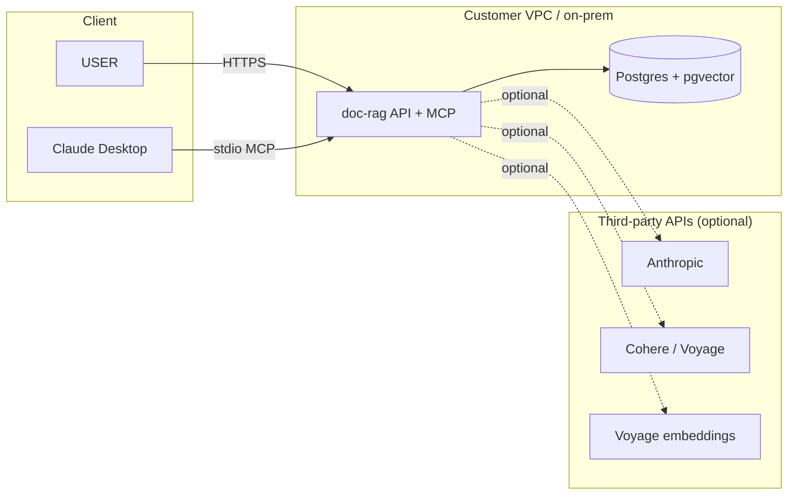

# DFD — doc-rag

## Level 0 — Context

## Level 1 — Pipeline stages

```mermaid
flowchart TD
  subgraph Ingest
    CR[1.0 Crawler / Reader<br/>sitemap / Confluence / Notion / file]
    PA[1.1 Parser<br/>HTML/PDF/MD -> text + meta]
    CH[1.2 Chunker<br/>token-aware]
    HS[1.3 Hasher<br/>stable chunk IDs]
  end

  subgraph Enrich
    CTX[2.0 Contextualiser<br/>document-level summary]
    EMB[2.1 Embedder]
  end

  subgraph Store
    PG[[Postgres<br/>documents / chunks]]
    VEC[[pgvector HNSW]]
    GIN[[tsvector GIN]]
  end

  subgraph Query
    HY[3.0 Hybrid retriever<br/>BM25 + dense + RRF]
    RR[3.1 Reranker<br/>Cohere / Voyage / local]
    GEN[3.2 Generator<br/>Anthropic + prompt cache]
  end

  subgraph Surface
    API[4.0 FastAPI<br/>/ask /retrieve /healthz]
    MCP[4.1 MCP server<br/>Claude Desktop tools]
    EV[4.2 Eval runner<br/>Ragas + golden set]
  end

  CR --> PA --> CH --> HS
  HS --> CTX --> EMB
  EMB --> PG
  EMB --> VEC
  CH --> GIN
  API --> HY
  MCP --> HY
  HY --> VEC
  HY --> GIN
  HY --> RR --> GEN
  GEN --> API
  GEN --> MCP
  EV --> HY
  EV --> GEN
```

## Level 2 — Ingest sequence (first-time)

## Level 2 — `/ask` query sequence

## Level 2 — MCP server integration with Claude Desktop

## Data stores

| Store | Purpose | Retention |
|-------|---------|-----------|
| `documents` | Source records + version history | Indefinite (30d for old versions) |
| `chunks` | Retrieval units + embeddings | Until re-ingested |
| `query_log` | Per-query audit + cost | 90 days default |
| `golden.jsonl` (in repo) | Eval harness fixtures | Versioned in git |

## Trust boundaries

## Data-egress toggles

Every external call is gated by a config flag. Privacy-sensitive deployments:

- `EMBEDDER=local-bge` — no embedding egress
- `RERANKER=local-bge-v2` — no rerank egress
- `GENERATOR=claude-haiku` or `none` — toggles answer generation egress
- `CONTEXTUALISER=disabled` — skips the document summary call

All of the above are honoured at startup and logged; disabling them degrades
quality (documented in THINK.md).

## Invariants

- Chunk IDs are deterministic from content-hash + chunk-index; re-ingest
  produces the same ID if content unchanged.
- `latest=true` at most once per `(source_url)`.
- Hybrid retrieval always returns at least one of BM25 or dense results if any
  exist (graceful on either backend being empty).
- `query_log` is append-only; a separate `query_log_redacted` view strips
  `query` for long-term storage.
